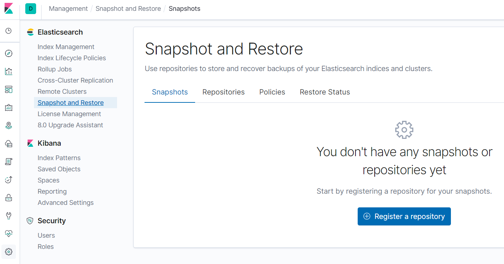
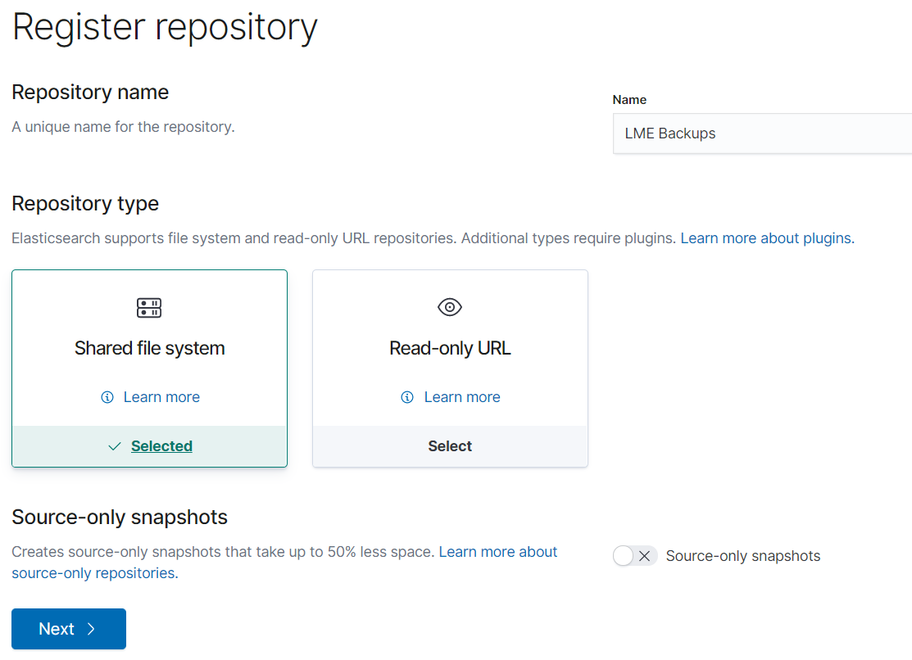
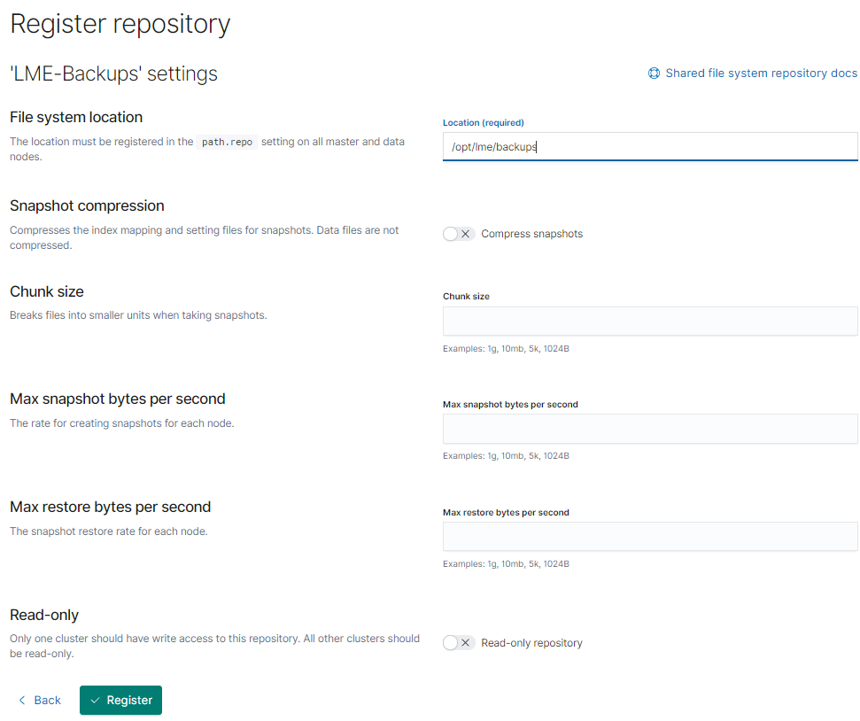
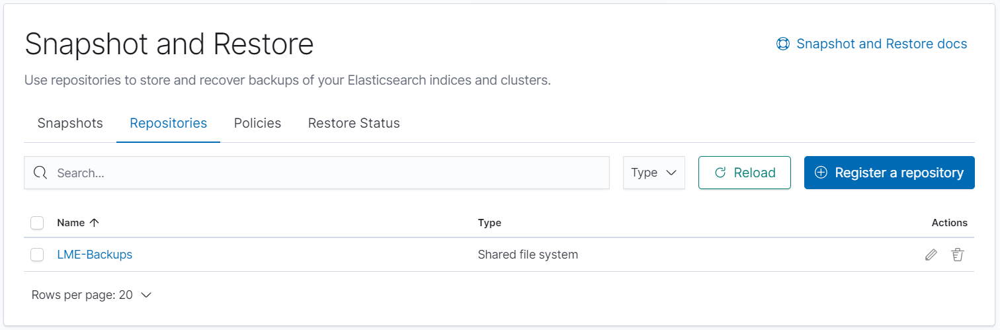
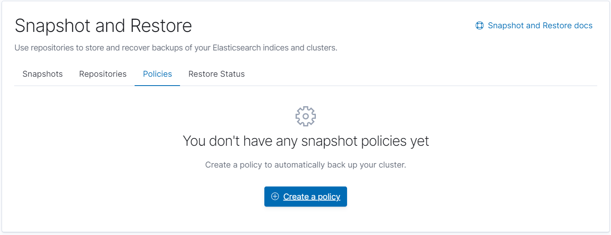
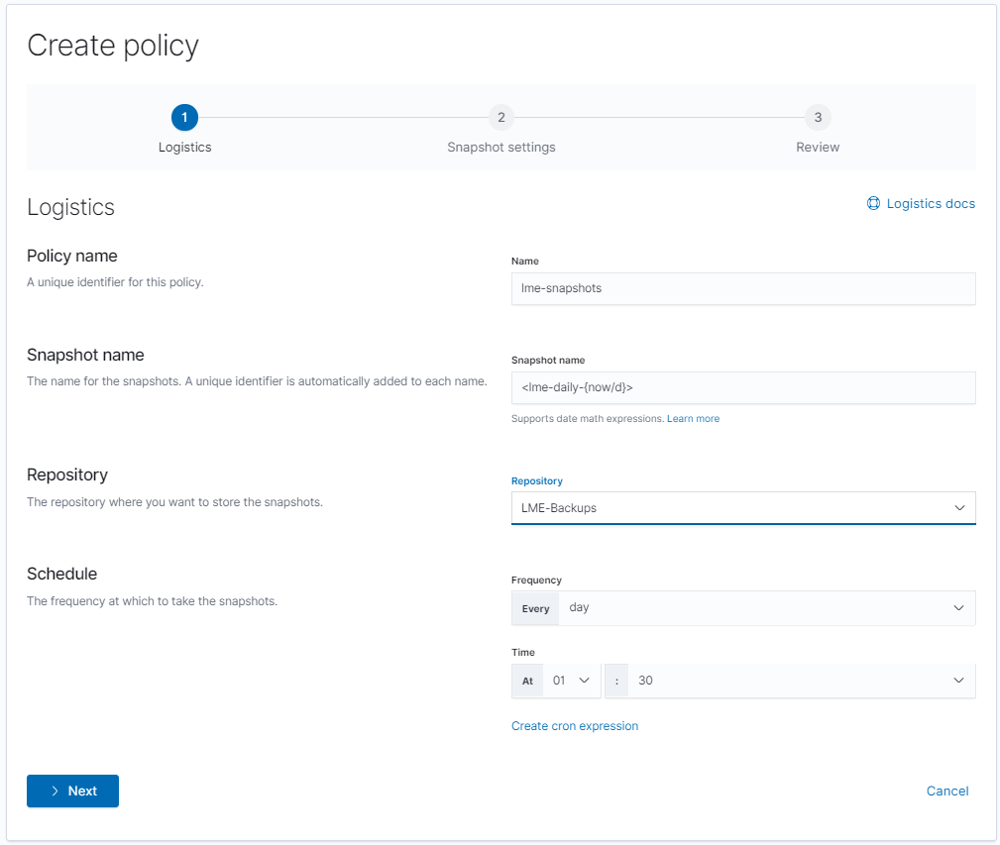
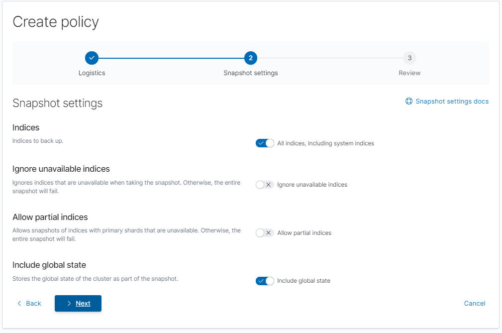
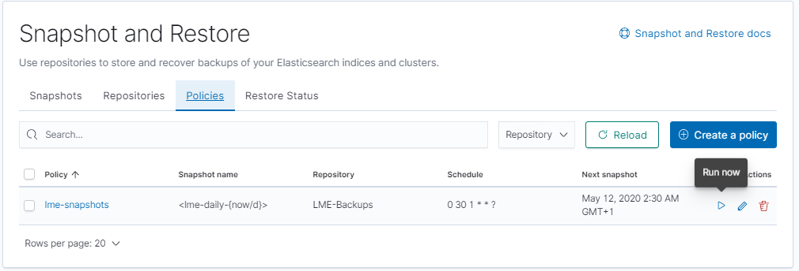

# Backing up LME Logs

Logs are backed up using the built-in Elastic facilities. Out of the box,
Elasticsearch supports backing up to filesystems, and this is the only approach
supported by LME. Other backup destinations are supported but these require
separate plugins, and are not supported by LME.

## Approach

Backups are created using Elasticsearch snapshots. The initial snapshot will
contain all of the current logs but subsequent backups will only contain changes
since the last snapshot was taken. It is therefore possible to take regular
backups without a significant effect on the system's performance and without
consuming large amounts of disk space.

## Setting up a backup schedule

### Create a filesystem repository

The LME installation creates a bind mount in Docker that maps to the
`/opt/lme/backups` directory on the host system.

The LME log retention period is determined by the amount of disk space on the
host system. Therefore it is **strongly** recommended that an external drive be
mounted at the `/opt/lme/backups` location so that both disk space is conserved
and to ensure that backups exist on a separate drive. Backups use a large volume of disk space, and if the storage volume provided is not suitable to store these logs without running out of space backups may cease to function, or LME may stop working altogether if all available disk space on the primary host is consumed.

Once the external drive has been mounted on the host, you will need to ensure the ownership of the `/opt/lme/backups` folder is correct, to ensure the elasticsearch user can write the backups correctly. By default this folder will likely be owned by the root user, and this will need to be changed so that it is owned by the user you created during the operating system's installation, typically Ubuntu or similar. This can be achieved using the following command:

```
sudo chown -R 1000 /opt/lme/backups/
```

**This will allow the user you configured during the system's installation to write to this location, so ensure that this user is appropriately secured.**

You will then need to create a repository for Elastic to use, which can be done through the Kibana interface.

First navigate to the "Snapshot and Restore" page under the management tab:



Then create a repository by clicking the "Register a repository" button and
filling in the following screens:



In the above picture, the repository has been named "LME-backups" but you can
select any other name as appropriate. The "Shared file system" repository type
should be selected.

On the next screen, the file system location should be set to
`/usr/share/elasticsearch/backups`. The other fields can be left with the default values, or modified as required.



The repository will be created and will show in the list on the management
screen:



### Create a snapshot schedule policy

You then need to create a policy for the backups. Select the "policies" tab and
then click the "Create a policy" button:



On the next screen, pick a name for your new policy ("lme-snapshots" in this
example). For the snapshot name the value `<lme-daily-{now/d}>` will create
files with the prefix `lme-daily` and with the current date as a suffix. Make
sure your new repository is selected, and then configure a schedule in line with
your backup policy. Elasticsearch uses incremental snapshots for its backup,
and so only the previous day's logs will need to be snapshotted, which will help
minimise the performance impact.



Leave the next screen with its default values and click "Next":



If desired, configure the next screen with the relevant retention settings based on your available disk space and your backup policy and then click "Next":


Review the new policy and click "Create policy".



If you want to test the new policy, or to create the initial snapshot, you can
select the "Run now" option for the policy on the polices tab:


## Backup management

Snapshots will now be periodically written to the drive mounted at
`/opt/lme/backups`. It is recommended that these are managed in line with your
current backup policies and processes.