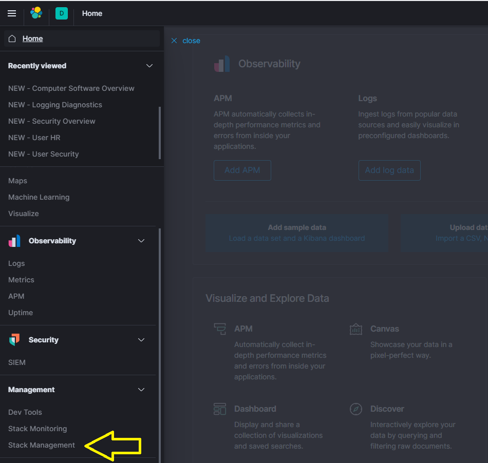
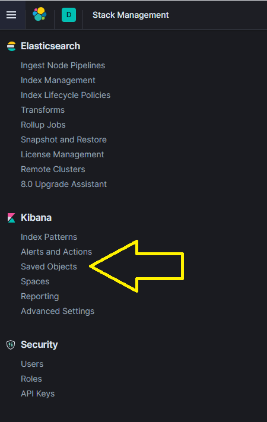
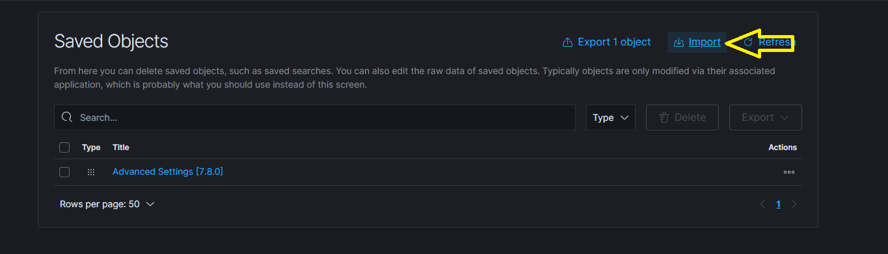
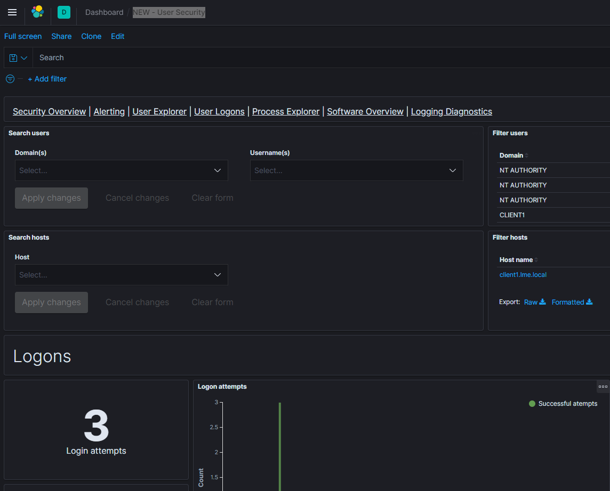
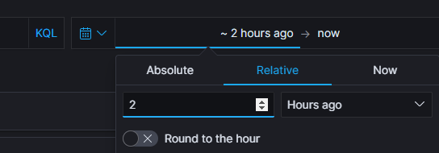
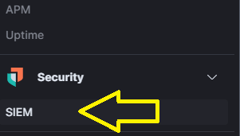
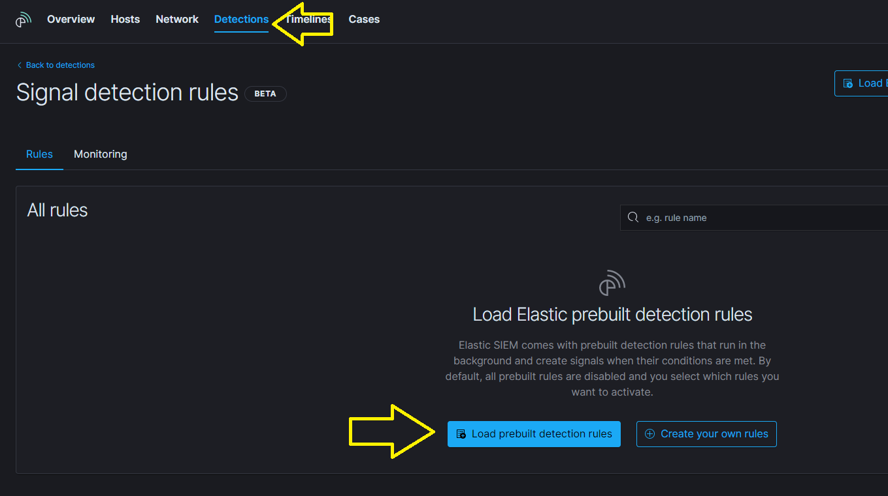
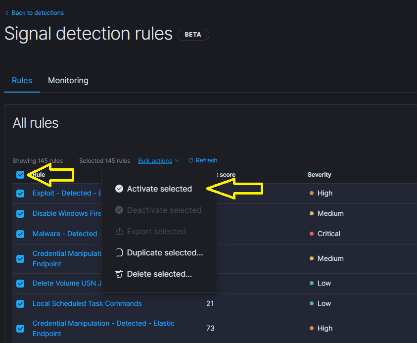
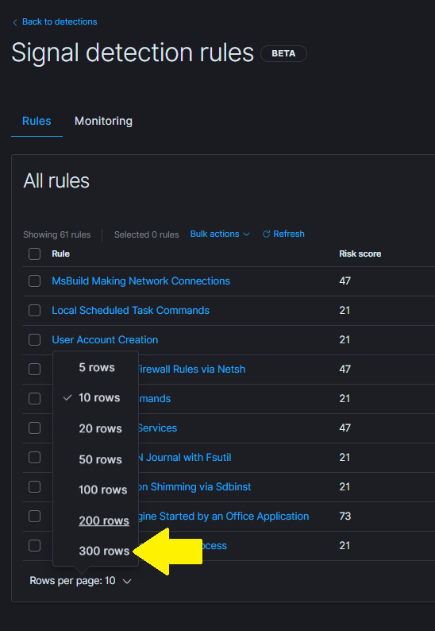
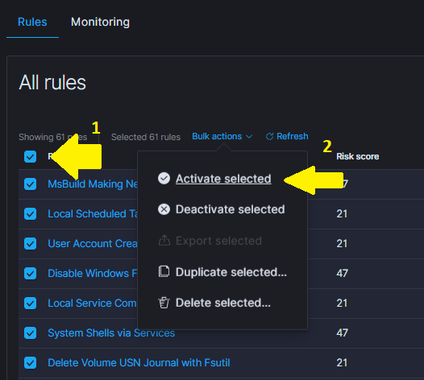

# Chapter 4 - Post Install Actions 

## Chapter Overview
In this chapter we will:
* Setup Kibana in order to view your logs
* Import some premade dashboards
* Check you are getting logs from your clients
* Enable the default detection rules

## 4.1 Initial Kibana setup

Once you have completed chapters 1 to 3, you can import a set of Kibana dashboards that we have created. These will help visualise the logs, and answer questions like 'What patch level are my clients running?'.

In a web browser, navigate to ```https:\\your_Linux_server``` and authenticate with the credentials provided in [Chapter 3.2](/docs/chapter3-easy.md#32-install-lme-the-easy-way-using-our-script).

### 4.1.1 Import Initial Dashboards

First you will need to create an index. If you would like to use the pre-made dashboards, the import process creates the index for you.

The dashboard and visualisation objects are contained within a NDJSON file (previously JSON) and can be easily imported 
***IMPORTANT: You must open the dashboard file (in notepad or similar) and use find and replace to change all instances of "ChangeThisDomain" to your kibana URL:***
* If you use a hostname to access kibana then it should be ```https://kibanahostname.example.com\``` where kibanahostname.example.com is your kibana DNS name
* If you use an ip to access kibana ```https://127.0.0.1\``` where 127.0.0.1 is the ip of your kibana

You can now import the dashboards by clicking ‘Management’ -> ‘Saved Objects’. Please follow the steps in Figure 1, and the NDJSON files are located in [Chapter 4 Files\dashboard 'version'.ndjson](/Chapter%204%20Files/).






<p align="center">
Figure 1 - Steps to import objects
</p>

A number of the dashboards should automatically be visible under the ‘Dashboard’ tab on the left-hand side.


### 4.1.2 Check you are receiving logs

Click on the 'Dashboard' tab, on the left-hand side then select 'NEW - User Security'. This will show a dashboard similar to Figure 2 (although the graphs will have less data on them).


<p align="center">
Figure 2 - The LME NEW - User Security - Overview
</p>

In the top right hand corner, click on 'Last 15 minutes' and select Today. This will change the date range to only include todays data, and the dashboard will then have an accurate representation of machines that have been sending logs. Changing to 'Last 7 days' will be useful in the future to visualise logs over time. Please see Figure 3 below.


<p align="center">
Figure 3 - Time range filter
</p>

## 4.2 Enable the Detection Engine








## 4.3 Learning how to use Kibana

If you have never used Kibana before, Elasticsearch have provided a number of videos exploring the features of Kibana and how to create new dashboards and analytics. https://www.youtube.com/playlist?list=PLhLSfisesZIvA8ad1J2DSdLWnTPtzWSfI

