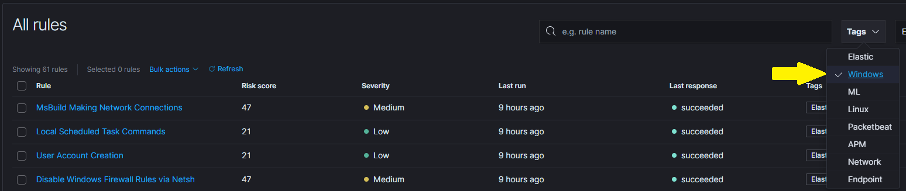

# Chapter 4 - Post Install Actions

## Chapter Overview
In this chapter we will:
* Log in to Kibana in order to view your logs
* Check you are getting logs from your clients
* Enable the default detection rules

## 4.1 Initial Kibana setup

Once you have completed chapters 1 to 3, you can import a set of Kibana dashboards that we have created. These will help visualise the logs, and answer questions like 'What patch level are my clients running?'.

In a web browser, navigate to ```https://your_Linux_server``` and authenticate with the credentials provided in [Chapter 3.2](/docs/chapter3.md#32-install-lme-the-easy-way-using-our-script).

### 4.1.1 Import Initial Dashboards

As of version 0.4 of LME, the initial process of creating an index and importing the dashboards should be handled automatically as part of the install process. This means upon logging in to Kibana a number of the dashboards should automatically be visible under the ‘Dashboard’ tab on the left-hand side.

If an error was encountered during the initial dashboard import then the upload can be reattempted by running the dashboard update script created within the root LME directory (**NOT** the one in 'Chapter 3 Files'):

```
cd /opt/lme
sudo ./dashboard_update.sh
```

If this does not resolve the issue or you wish to manually import the dashboards for whatever reason, see [4.4](#44-troubleshooting---manual-dashboard-install) for the previous installation instructions.

### 4.1.2 Check you are receiving logs

Click on the 'Dashboard' tab, on the left-hand side then select 'NEW - User Security'. This will show a dashboard similar to Figure 2 (although the graphs will have less data on them).


<p align="center">
Figure 2 - The LME NEW - User Security - Overview
</p>

In the top right hand corner, click on 'Last 15 minutes' and select Today. This will change the date range to only include todays data, and the dashboard will then have an accurate representation of machines that have been sending logs. Changing to 'Last 7 days' will be useful in the future to visualise logs over time. Please see Figure 3 below.


<p align="center">
Figure 3 - Time range filter
</p>

## 4.2 Enable the Detection Engine

In the left hand options, under Security, navigate to "Detections" (In recent versions, this may be titled "Alerts"):


From here navigate to "Manage Detection Rules" (In recent versions, this may be titled "Manage Rules"):



Once this has been done, select the option to "Load Elastic prebuilt rules and timeline templates":


Once the prebuilt Elastic rules are installed, filter from the "Tags" option and select "Windows":


From here, ensure that the maximum number of rows is shown so that all of the relevant rules can be selected at once (In recent versions, there is an ability to "Select All" rows):


Lastly, select all of the displayed rules, expand "Bulk actions" and choose "Activate selected":


In recent versions of Elastic that include Machine Learning rules (rules with the "ML" tag), you may receive errors when performing bulk actions: 


Rules without the "ML" tag should still be activated through this bulk action, regardless of this error message. Use of "ML" rules require Machine Learning to be enabled, which is part of Enterprise and Platinum Elastic subscriptions.

### 4.2.1 Add rule exceptions

Depending on your environment it may be desirable to add exceptions to some of the built-in Elastic rules shown above to prevent false positives from occuring. These will be specific to your environment and should be tightly scoped so as to avoid excluding potentially malicious behaviour, but may be beneficial to filter out some of the benign behaviour of LME (for example to prevent the Sysmon update script creating alerts). 

An example of this is shown below, with further information available [here](https://www.elastic.co/guide/en/security/current/detections-ui-exceptions.html).

First, navigate to the "Manage Detection Rules" section as described above, and then search for and select the rule you wish to add an exception for:


Then navigate to the "Exceptions" tab above the "Trend" section and then select "Add new exception":


From here, configure the necessary exception, taking care to ensure that it is tightly scoped and will not inadvertently prevent detection of actual malicious behaviour:


Note that in this instance the following command line value has been added as an exception, but the ```testme.local``` domain would need to be updated to match the location you installed the update batch script to during the LME installation, the same value used to update the scheduled task as described [here](chapter2.md#222---scheduled-task-gpo-policy).

```
C:\Windows\SYSTEM32\cmd.exe /c "\\testme.local\SYSVOL\testme.local\Sysmon\update.bat"
```

## 4.3 Learning how to use Kibana

If you have never used Kibana before, Elasticsearch have provided a number of videos exploring the features of Kibana and how to create new dashboards and analytics. https://www.youtube.com/playlist?list=PLhLSfisesZIvA8ad1J2DSdLWnTPtzWSfI

## 4.4 Troubleshooting - Manual Dashboard Install

This step should not be required by default, and should only be used if the installer has failed to automatically populate the expected dashboards or if you wish to make use of your own modified version of the supplied visualisations.

The dashboard and visualisation objects are contained within a NDJSON file (previously JSON) and can be easily imported

***IMPORTANT: You must open the dashboard file and use find and replace to change all instances of "ChangeThisDomain" to your kibana URL. Avoid using Notepad.exe for this as it may replace line ending characters resulting in issues:***
* If you use a hostname to access kibana then it should be ```https://kibanahostname.example.com\``` where kibanahostname.example.com is your kibana DNS name
* If you use an IP address to access kibana ```https://127.0.0.1\``` where 127.0.0.1 is the IP address of your kibana

You can now import the dashboards by clicking ‘Management’ -> ‘Stack Management’ -> ‘Saved Objects’. Please follow the steps in Figure 1, and the NDJSON files are located in [Chapter 4 Files\dashboards.ndjson](/Chapter%204%20Files/).


<p align="center">
Figure 1 - Steps to import objects
</p>