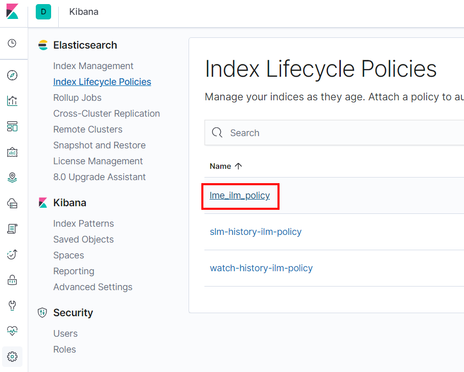
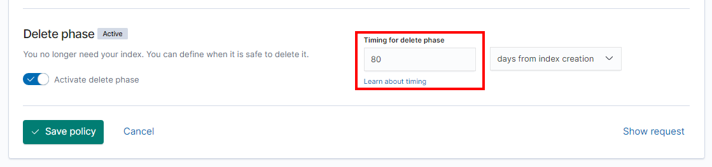

# Retention Settings

By default, LME will configure an index lifecycle policy that will delete
indexes based on estimated disk usage. Initially, 80% of the disk will be used
for the indices, with an assumption that a day of logs will use 1Gb of disk
space.

If you wish to adjust the number of days retained, then this can be done in
Kibana. First, select the `lme_ilm_policy` from the "Index Lifecycle Policies"
list:

Next, scroll to the bottom of the settings page and adjust the "Delete phase"
setting as appropriate.

Care must be taken to ensure that the retention period is appropriate for the disk space available. If disk space is exhausted then the solution will experience performance issues and new logs will not be recorded.