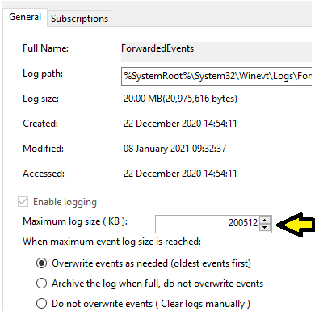

# Troubleshooting LME install


<p align="center">  
Figure 1: Troubleshooting overview diagram
</p>

| Diagram Ref| Protocol information | Process Information | Log file location | Common issues |
| :---: |-------------| -----| ---- | ---------------- |
| a | Outbound WinRM using TCP 5985 Link is HTTP, underlying data is authenticated and encrypted with Kerberos. </br></br> See [this Microsoft article](https://docs.microsoft.com/en-us/windows/security/threat-protection/use-windows-event-forwarding-to-assist-in-intrusion-detection) for more information | On the Windows client, Press Windows key + R. Then type 'services.msc' to access services on this machine. You should have: </br></br> ‘Windows Remote Management (WS-Management)’ </br> and </br> ‘Windows Event Log’ </br></br> Both of these should be set to automatically start and be running. WinRM is started via the GPO that is applied to clients. | Open Event viewer on Windows Client. Expand ‘Applications and Services Log’->’Microsoft’->’Windows’->’Eventlog-ForwardingPlugin’->Operational | “The WinRM client cannot process the request because the server name cannot be resolved.” </br> This is due to network issues (VPN not up, not on local LAN) between client and the Event Collector.|
| b | Inbound WinRM TCP 5985 | On the Windows Event Collector, Press Windows key + R. Then type 'services.msc' to access services on this machine. You should have:  </br></br> ‘Windows Event Collector’ </br></br> This should be set to automatic start and running. It is enabled with the GPO for the Windows Event Collector. | Open Event viewer on Windows Event Collector. </br></br> Expand ‘Applications and Services Log’->’Microsoft’->’Windows’->’EventCollector’->Operational </br></br> Also, in Event Viewer check the subscription is active and clients are sending in logs. Click on ‘Subscriptions’, then right click on ‘lme’ and ‘Runtime Status’. This will show total and active computers connected. | Restarting the Windows Event Collector machine can sometimes get clients to connect. |
| c | Outbound TCP 5044. </br></br> Lumberjack protocol using TLS mutual authentication. Certificates generated as part of the install, and downloaded as a ZIP from the Linux server. | On the Windows Event Collector, Press Windows key + R. Then type 'services.msc' to access services on this machine. You should have: </br></br> ‘winlogbeat’. </br></br> It should be set to automatically start and is running. | %programdata%\winlogbeat\logs\winlogbeat | TBC |
| d | Inbound TCP 5044. </br> </br> Lumberjack protocol using TLS mutual authentication. Certificates generated as part of the install. | On the Linux server type ‘sudo docker stack ps lme’, and check that lme_logstash, lme_kibana and lme_elasticsearch all have a **current status** of running.  | On the Linux server type: </br> </br> ‘sudo docker service logs -f lme_logstash’ | TBC |


## Common Errors
### Windows Log with Error Code #2150859027
If you are on Windows 2016 or higher and are getting error code 2150859027, or messages about HTTP URLs not being available in your Windows logs, we suggest looking at [this guide.](https://support.microsoft.com/en-in/help/4494462/events-not-forwarded-if-the-collector-runs-windows-server-2019-or-2016)

### No logs forwarded from Member Servers
Check the following:

* Sysmon service is running on the client
* The [LME-WEC-Client-GPO](/Chapter%201%20Files/lme_gpo_for_windows.zip) is applying to the member server
* That the member server has been rebooted to apply permissions to the logs ([see issue #41](https://github.com/ukncsc/lme/issues/41#issuecomment-554037796))

### Events not forwarding from Domain Controllers
Please be aware that Logging Made Easy does not currently support logging Domain Controllers, and the log volumes may be significant from servers with this role.  If you wish to proceed forwarding logs from your Domain Controllers please be aware you do this at your own risk!  Monitoring such servers has not been tested or endorsed by the NCSC and may have unintended side effects.

### Importing the Kibana dashboard hangs
Importing the dashboards manually is described in [section 4.1.4](/docs/chapter4.md#44-troubleshooting---manual-dashboard-install).  First, ensure you have modified the latest dashboards file from Github to replace `ChangeThisDomain` with your Kibana server’s DNS name.  Note that it’s imperative that you keep the trailing backslash (e.g. `https://kibanahostname.example.com\`) otherwise importing the file to Kibana will hang.  This is discussed more in [issue #74](https://github.com/ukncsc/lme/issues/74).

### Events not forwarded to Kibana
The `winlogbeat` service installed in [section 3.3](/docs/chapter3.md#33-configuring-winlogbeat-on-windows-event-collector-server) is responsible for sending events from the collector to Kibana.  Confirm the `winlogbeat` service is running and check the log file (`C:\ProgramData\winlogbeat\logs`) for errors.

By default the `ForwardedEvents` maximum log size is around 20MB so events will be lost if the `winlogbeat` service stops.  Consider increasing the size of the `ForwardedEvents` log file to help reduce log loss in this scenario.  Historical logs are sent once the `winlogbeat` service starts.

* Open Microsoft Event View (`eventvwr`)
* Expand _Windows Logs_ and right click _Forwarded Events_
* Click _properties_
* Adjust _Maximum log size (KB)_ to a higher value.  Note that the system will automatically adjust the size to the nearest multiple of 64KB.



### Kibana Discover View Showing Wrong Index
If the Discover section of Kibana is persistently showing the wrong index by default it is worth checking that the winlogbeat index pattern is still set as the default within Kibana. This can be done using the steps below:

Select "Stack Management" from the left hand menu:


Select "Index Patterns" under Kibana Stack Management:


Verify that the "Default" label is set next to the ```winlogbeat-*``` Index pattern:


If this Index pattern is not selected as the default, this can be re-done by clicking on the ```winlogbeat-*``` pattern and then selecting the following option in the subsequent page:


### Re-Indexing Errors
For errors encountered when re-indexing existing data as part of an an LME version upgrade please review the Elastic re-indexing documentation for help, available [here](https://www.elastic.co/guide/en/elasticsearch/reference/current/docs-reindex.html).
